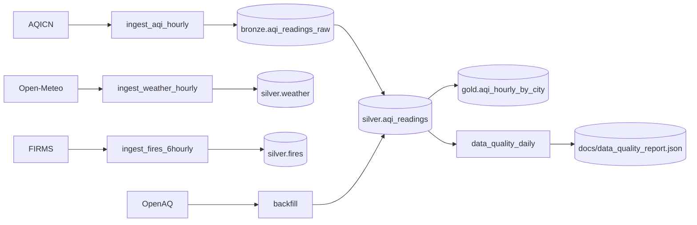

# AirQualityCast

> Production-grade data pipeline ingesting AQI, weather, and satellite-fire data across India — the foundation for a hyperlocal air-quality forecasting system.

## Overview
**Phase 1** (this repo): a TimescaleDB + Airflow pipeline ingesting from AQICN, Open-Meteo, NASA FIRMS, and OpenAQ, organised in a bronze/silver/gold medallion architecture with continuous aggregates, retention, and compression.
Phase 2 will train multi-horizon forecasting models on top of `silver.*`; Phase 3 will serve them via FastAPI + a Claude-powered attribution layer.



## Features
- 4 scheduled Airflow DAGs (AQI hourly, weather hourly, fires 6-hourly, data quality daily).
- Idempotent upserts; bronze JSONB preserves every raw API response.
- TimescaleDB hypertables, retention (30-day bronze), native compression (>14 d silver).
- PostGIS for station/fire spatial joins.
- One-shot historical backfill of ≥1 year × ≥50 stations from OpenAQ.
- Async ingestion clients with `tenacity` retries; structlog JSON logging.
- Pydantic v2 models for every external response.
- 75 %+ unit-test coverage with a real Timescale service container in CI.

## Tech stack
| Layer            | Tool                                 |
| ---------------- | ------------------------------------ |
| Language         | Python 3.11                          |
| Package manager  | `uv`                                 |
| Database         | TimescaleDB (PG16) + PostGIS         |
| Orchestration    | Apache Airflow 2.9 (LocalExecutor)   |
| HTTP / retries   | `httpx` (async), `tenacity`          |
| Validation       | Pydantic v2 + `pydantic-settings`    |
| DB driver        | `psycopg` v3 + connection pool       |
| Logging          | `structlog` (JSON)                   |
| Lint / typing    | `ruff`, `mypy --strict`              |
| Testing          | `pytest`, `respx`, `pytest-cov`      |
| CI               | GitHub Actions (Timescale service)   |
| EDA              | pandas, matplotlib, folium, plotly   |

## Quickstart
```bash
git clone <repo> && cd Atmos
cp .env.example .env                         # fill in API keys + a fernet key
make setup                                   # uv sync + pre-commit
make up                                      # docker compose up -d (TimescaleDB + Airflow)
make bootstrap                               # discover Indian AQICN stations
make backfill                                # ≥1 yr / ≥50 stations from OpenAQ + Open-Meteo
open http://localhost:8080                   # Airflow UI
```
DAGs are unpaused on creation and start firing on the next cron tick.

## Data sources
| Source     | Cadence    | Auth        | Notes                                                |
| ---------- | ---------- | ----------- | ---------------------------------------------------- |
| AQICN      | hourly     | free token  | primary live AQI; offline stations return `aqi: "-"` |
| Open-Meteo | hourly     | none        | weather + boundary-layer height                      |
| NASA FIRMS | 6-hourly   | MAP_KEY     | VIIRS active-fire CSV; 3-6 h detection lag           |
| OpenAQ v3  | one-time   | API key     | historical backfill only                             |

## Architecture
See `docs/architecture.md` for the full data-flow diagram and storage estimate, `docs/schema.md` for table-by-table column reference, and `docs/runbook.md` for operations.

## Database schema
Three schemas: `bronze` (raw JSONB, 30-day TTL), `silver` (cleaned, typed, deduplicated — ML-ready), `gold` (continuous aggregates / Phase 2 feature store).
Detailed columns and indexes in [`docs/schema.md`](docs/schema.md).

## Data quality
The `data_quality_daily` DAG runs at 02:30 UTC, deactivates stations stale > 24 h, computes per-station PM2.5 missing rates over a 7-day window, and writes `docs/data_quality_report.json`. The DAG fails loudly if the global PM2.5 null rate exceeds 30 %.

## EDA highlights
`notebooks/01_eda.ipynb` runs end-to-end from a fresh stack and produces all 8 visualisations from the PRD §9 (station map, Delhi PM2.5 timeline, Diwali spike, stubble-fire correlation, hour×DoW heatmap, wind rose, monsoon washout, completeness heatmap).

## Project structure
```
src/airqualitycast/   # ingestion clients, db helpers, processing, quality, backfill
airflow/dags/         # 4 DAGs + utils (db conn, alerting)
sql/                  # schema migrations (run on container init)
scripts/              # bootstrap_stations, run_backfill, check_data_quality
notebooks/            # 01_eda.ipynb
tests/                # unit + integration + fixtures
docs/                 # architecture, schema, runbook
```

## Roadmap
- **Phase 2** — LightGBM / XGBoost multi-horizon AQI forecasting (t+1 h, +6 h, +24 h, +72 h) with spatiotemporal features built on top of `silver.*`.
- **Phase 3** — FastAPI serving + Claude-powered source attribution and personalised health advisories.

## Contributing & License
PRs welcome. MIT.
