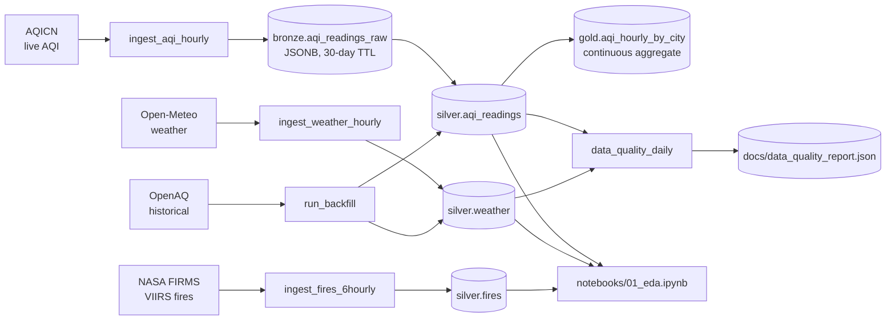

# Architecture

## High-level data flow

## Components

| Component        | Responsibility                                                                |
| ---------------- | ----------------------------------------------------------------------------- |
| **TimescaleDB**  | Hypertable storage with retention + native compression on chunks > 14 days.   |
| **PostGIS**      | `geom` columns for spatial joins (stations × fires within radius).            |
| **Airflow**      | Scheduler + LocalExecutor. Idempotent DAGs, retries with exponential backoff. |
| **Ingestion**    | Async `httpx` clients with `tenacity` retries → Pydantic v2 models.           |
| **Bronze→Silver**| Re-parse the last hour of bronze JSONB to recover from parser bugs.           |
| **Quality DAG**  | Daily PM2.5 freshness/missing-rate; writes JSON snapshot for the README.      |

## Storage estimate (1 year)

- 250 stations × 24 readings/day × 365 days × ~120 B/row ≈ **0.26 GB** raw silver AQI
- 250 stations × 48 hourly weather × 365 × ~150 B/row ≈ **0.66 GB** silver weather
- ~50k fires/year × ~200 B/row ≈ **10 MB** silver fires
- Bronze raw payloads (TTL 30 d) ≈ 0.5 GB rolling

After Timescale compression on chunks > 14 d: **< 1.5 GB** total. Well under the 5 GB target.
